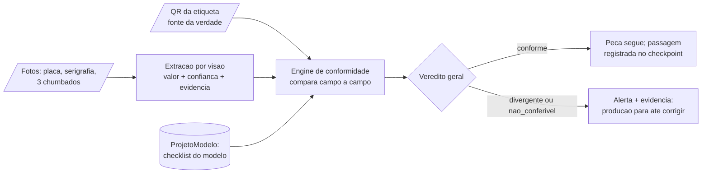

# TRAEL Conferência

Sistema de conferência de identidade e rastreabilidade de transformadores na
linha de produção da TRAEL — desafio do **HackStars Batch #2**.

## O problema

A identidade de um transformador existe em três lugares físicos da peça,
gravados por processos diferentes: o patrimônio serigrafado em tinta no tanque,
a placa de identificação rebitada (série, patrimônio e dados técnicos) e o
número de série chumbado no metal em 3 posições. A etiqueta com QR code é a
fonte da verdade. Hoje a conferência entre essas fontes é visual e manual, e
erros passam: a própria peça de demonstração do desafio sai da linha com a
placa gravada **847833** enquanto etiqueta e série chumbada dizem **847233**.
Quando essa divergência chega à montagem final, ao laboratório ou ao cliente,
vira retrabalho, não conformidade, atraso de expedição e risco de multa.

## Como funciona

1. **QR** — o operador lê a etiqueta no navegador do celular; o payload vira os
   valores esperados (série, patrimônio, cliente). A tela abre fixada em uma
   etapa da linha via `?etapa=<codigo do checkpoint>`.
2. **Fotos** — captura das fontes físicas (placa, serigrafia, série chumbada nas
   3 posições); cada foto é persistida como evidência no S3.
3. **Extração** — o adapter de visão (Textract/Bedrock, atrás de
   `ExtractorPort`) devolve cada valor lido com score de confiança e vínculo à
   foto de origem. Leitura sem lastro não entra no banco.
4. **Engine** — a API compara campo a campo o lido contra o esperado do QR,
   usando a checklist do `ProjetoModelo` da peça. Veredito por campo:
   `conforme` | `divergente` | `nao_conferivel`; geral por precedência
   `divergente` > `nao_conferivel` > `conforme`.
5. **Veredito** — a tela mostra campo a campo com a foto-evidência de cada
   leitura; divergência dispara alerta (a produção para até corrigir) e a
   passagem da peça pelos checkpoints fica registrada.



## Regra de ouro

> **O veredito de conformidade nasce exclusivamente na API: o front nunca
> compara campos, e todo dado extraído por visão/OCR entra no sistema com score
> de confiança e foto-evidência anexada, nunca como fato.**

É o coração do sistema porque a dor do desafio é o **falso OK**: um campo
ilegível rebaixado para `conforme` é exatamente a não conformidade que chega ao
cliente hoje. Toda decisão de arquitetura (engine pura, porta de extração,
caminho único de escrita de veredito) existe para tornar isso impossível.

## Stack

| Camada  | Tecnologia                                                       |
| ------- | ---------------------------------------------------------------- |
| API     | NestJS (base brocoders/nestjs-boilerplate), TypeORM + PostgreSQL |
| Front   | Next.js 16 (React 19, Tailwind 4), mobile-first                  |
| Visão   | AWS Textract e Bedrock (Claude) — escolha pendente do spike T2.1 |
| Storage | AWS S3 (fallback: disco local)                                   |

## Como rodar

```bash
# 1ª vez: criar o env (APP_PORT=3001 vive só aí; sem ele a API sobe em :3000)
cd backend && sed 's/^DATABASE_HOST=postgres/DATABASE_HOST=localhost/' env-example-relational > .env
cd backend && docker compose up -d postgres && npm run migration:run && npm run seed:run:relational
cd backend && npm run start:dev   # API em :3001, swagger em /docs
cd frontend && npm run dev        # app em :3000; API derivada do host da página
cd backend && npm run test        # 96 testes unitários (engine, parser, extração)
# CRUD gerado exige JWT: login com o admin seed do boilerplate
# (admin@example.com / secret) em POST /api/v1/auth/email/login
```

`EXTRACTOR_DRIVER=mock` é o default: o sistema sobe e a conferência roda ponta a
ponta **sem nenhuma credencial AWS**. Trocar para `textract` ou `bedrock` é
mudança de env, não de código (ver [docs/aws.md](docs/aws.md)).

## Teste rápido do coração do sistema

Cenário da peça de demo pela API, sem front e sem AWS:

```bash
TOKEN=$(curl -s -X POST http://localhost:3001/api/v1/auth/email/login \
  -H 'Content-Type: application/json' \
  -d '{"email":"admin@example.com","password":"secret"}' | jq -r .token)

# etiqueta e chumbado dizem 847233; a placa foi gravada 847833
# (patrimônio e cliente abaixo são ilustrativos; só as séries vêm da peça real)
curl -s -X POST http://localhost:3001/api/v1/conferencias/executar \
  -H "Authorization: Bearer $TOKEN" -H 'Content-Type: application/json' \
  -d '{
    "payloadQr": "{\"numeroSerie\":\"847233\",\"patrimonio\":\"251328\",\"cliente\":\"143091 - Energisa Rondônia Distribuidora de Energia S.A\",\"codigoProjeto\":\"EPT-163-PI-676\"}",
    "etapaCodigo": "fixacao-placa",
    "leituras": [
      { "campo": "serie-chumbada-1",  "valorLido": "847233",       "confianca": 0.96 },
      { "campo": "serie-placa",       "valorLido": "847833",       "confianca": 0.98 },
      { "campo": "patrimonio-placa",  "valorLido": "251328",       "confianca": 0.95 },
      { "campo": "cliente-serigrafia","valorLido": "143091 - Energisa Rondônia Distribuidora de Energia S.A", "confianca": 0.93 }
    ]
  }'
```

Resultado esperado: `vereditoGeral: "divergente"`, com `serie-placa` como o
único campo `divergente`. Os campos obrigatórios do checklist sem leitura neste
exemplo abreviado (`serie-chumbada-2/3`, `patrimonio-serigrafia`) voltam
`nao_conferivel` — enviando as 7 leituras completas, o resultado é exatamente o
critério de aceitação 2 do SPEC.

## Ver funcionando (celular ou navegador)

**https://qzat8cp2m8.us-east-1.awsapprunner.com/demo** — página de teste
servida pela própria API: escolha a etapa, leia o QR pela câmera, fotografe
as faces (vão para o S3) e dispare a conferência para ver o veredito campo a
campo com a foto-evidência. É temporária, para inspecionar a API sem depender
do app; o app real é o `frontend/`.

API no ar: `https://qzat8cp2m8.us-east-1.awsapprunner.com` (Swagger em `/docs`).
Coleção de testes pronta em `docs/trael-api.postman_collection.json`.

## Endpoints principais

A lista completa e sempre atual está no Swagger: `http://localhost:3001/docs`.
Todos exigem JWT (login abaixo), exceto `GET /` e os arquivos de evidência.

| Método | Rota | Papel |
| --- | --- | --- |
| POST | `/api/v1/auth/email/login` | Token JWT (admin seed: `admin@example.com` / `secret`) |
| POST | `/api/v1/conferencias/executar` | O coração: QR + leituras → veredito campo a campo persistido |
| POST | `/api/v1/fotos-evidencia/upload` | Multipart: foto + `fonteFisica` (whitelist canônica) → URL assinada |
| GET | `/api/v1/checkpoints` | Etapas ordenadas da linha (seed: 4 etapas com slug) |
| GET | `/api/v1/projetos-modelo` | Projetos com checklist (seed: modelo da peça de demo) |
| CRUD | `/api/v1/{transformadores, conferencias, campos-conferidos, fotos-evidencia, passagens}` | Gerados pelo boilerplate; `PATCH /campos-conferidos/:id` responde 422 (imutável — trilha de auditoria) |

## Status

Prazo: demo em 2026-07-27.

| Fase                                   | Escopo                                                    | Status                  |
| -------------------------------------- | --------------------------------------------------------- | ----------------------- |
| 0 — Fundação                           | scaffolds, 7 entidades, migrations, seeds da linha e do modelo | ✅ completa         |
| 1 — Núcleo de conformidade (TDD)       | parser do QR, engine pura, `POST /conferencias/executar`   | ✅ completa             |
| 2 — Extração por visão                 | `ExtractorPort` + adapters textract/bedrock/mock, upload S3 | ✅ exceto o spike T2.1  |
| 3 — Fluxo ponta a ponta                | QR no celular, captura de fotos, tela de veredito          | a fazer                 |
| 4 — Trânsito e alerta                  | Passagem, histórico da peça, alerta de divergência         | a fazer                 |
| 5 (opcional) — Dashboard e indicadores | linha e auditoria por etapa/campo                          | a fazer                 |
| 6 (opcional) — Ingestão do projeto     | PDF do desenho → checklist via Bedrock → revisão           | a fazer                 |

O único item aberto da Fase 2 é o **spike T2.1** (Textract × Bedrock com as
fotos reais), bloqueado por fatores externos e documentado em
[docs/aws.md](docs/aws.md): S3 e Textract funcionam, mas a conta é nova e as
cotas de inferência Claude no Bedrock estão em 0 (4 pedidos PENDING no Service
Quotas), e as fotos da peça ainda não estão em arquivo. O sistema não depende
disso para rodar — o driver `mock` cobre o fluxo, e a escolha do spike vira
troca de env. O frontend hoje tem apenas a rota placeholder de conferência
(Fase 3).

## Documentação

| Arquivo                                              | Para quê                                                       |
| ---------------------------------------------------- | -------------------------------------------------------------- |
| [SPEC.md](SPEC.md)                                   | o quê e por quê: problema, entidades, MoSCoW, critérios de aceitação, rodadas futuras |
| [PLAN.md](PLAN.md)                                   | execução: fases, tasks, desvios registrados e status real       |
| [CLAUDE.md](CLAUDE.md)                               | contrato de código: regra de ouro, fronteiras, convenções, gaps conhecidos |
| [docs/aws.md](docs/aws.md)                           | AWS: serviços, modelos, custos, setup e estado da conta         |
| [docs/regras-de-negocio.md](docs/regras-de-negocio.md) | regras de negócio consolidadas (em redação)                   |

## Time

Equipe 3 — HackStars Batch #2.
