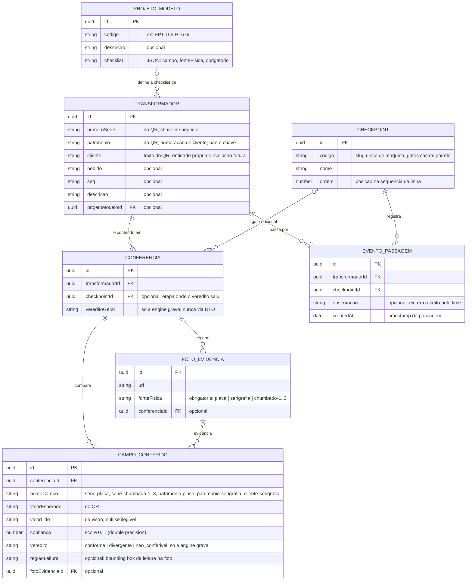
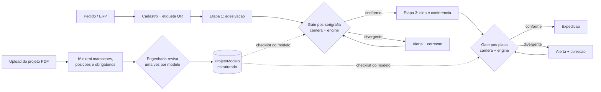

# SPEC.md

> Descreve o **sistema de conferência e rastreabilidade de transformadores
> TRAEL** — o que vamos construir no HackStars Batch #2. O que foi planejado
> mas não faz parte desta rodada vive na seção final "Planejado / rodadas
> futuras" — nada fora dela deve ser lido como escopo da primeira entrega.

## Problema

A TRAEL fabrica transformadores cuja identidade física existe em três lugares
da peça, gravados por processos diferentes: o número de patrimônio serigrafado
em tinta preta no tanque, a placa de identificação (placa preta rebitada, com
número de série, patrimônio e dados técnicos) e o número de série chumbado no
metal em 3 posições. A etiqueta adesiva com QR code é a fonte da verdade: traz
pedido, número de série, seq, patrimônio, cliente e descrição do produto.

Hoje a conferência entre essas fontes é visual e manual. Erros passam: uma peça
pode sair com série da placa divergente da série chumbada e da etiqueta (a
própria peça de demonstração do desafio carrega esse defeito: placa 847833,
etiqueta e chumbado 847233). Quando o erro chega à montagem final, laboratório
ou ao cliente, gera retrabalho, não conformidade, atraso de expedição e risco
de multa — as dores centrais do desafio TRAEL (doc "Rastreabilidade Inteligente
de Transformadores na Linha de Produção").

Este projeto automatiza a conferência: o operador lê o QR da etiqueta,
fotografa a peça com o celular, e o sistema extrai por visão computacional os
valores físicos, compara campo a campo com o QR e emite veredito com evidência
fotográfica. Sobre a mesma base, registra a passagem da peça por checkpoints da
linha, dando rastreabilidade de trânsito.

## Usuários

- **Operador de conferência** — lê o QR, fotografa a peça, recebe o veredito.
  Nesta rodada não há perfis nem permissões; qualquer pessoa com acesso ao app
  executa qualquer ação.
- **(Rodada futura) perfis por setor** — montagem final, laboratório,
  expedição, qualidade; marcados como futuros, não misturados ao atual.

## Entidades

- **Transformador** — identidade esperada da peça, criada a partir do payload
  do QR: número de série, patrimônio, pedido, seq, cliente, descrição, e
  vínculo opcional ao ProjetoModelo. `numeroSerie` é a chave de negócio (única
  do fabricante; por isso é chumbada 3× no metal): find-or-create usa ela.
  Patrimônio é numeração do cliente — único por cliente, não globalmente;
  nunca serve de chave.
- **ProjetoModelo** — o projeto de serigrafia de um modelo como dado: código
  (ex.: EPT-163-PI-676), descrição e checklist de campos a conferir (nome,
  fonte física, obrigatoriedade). É de onde a engine tira a lista de campos —
  nunca de constante no código. Seed do MVP: o modelo da peça de demo,
  transcrito manualmente do desenho; ingestão automática do PDF é evolução
  (Could).
- **Conferencia** — uma execução de verificação de uma peça: referência ao
  Transformador, conjunto de CampoConferido, veredito geral, timestamp,
  opcionalmente vinculada a um Checkpoint — quando presente, o vínculo
  registra em qual etapa da linha o erro foi acusado. Pode cobrir um
  subconjunto de campos: no fluxo real da TRAEL a conferência acontece em
  gates parciais (pós-serigrafia e pós-placa), não de uma vez só.
- **CampoConferido** — um campo comparado: nome (ex.: serie-placa,
  serie-chumbada-1..3, patrimonio-serigrafia, patrimonio-placa, cliente), valor
  esperado (do QR), valor lido (da visão), score de confiança, veredito
  (`conforme` | `divergente` | `nao_conferivel`), referência à FotoEvidencia e
  `regiaoLeitura` opcional (bounding box de onde o valor foi lido na foto —
  matéria-prima da conferência posicional futura, custo zero com Textract).
- **FotoEvidencia** — foto enviada pelo operador, armazenada com URL e vínculo
  aos campos extraídos dela.
- **Checkpoint** — etapa ordenada da linha de produção, com posição na
  sequência e `codigo` estável de máquina (slug único, ex.: `serigrafia`):
  regras de gate casam por ele, nunca por nome exibido nem por ordem. Etapas
  reais informadas pelo time: adesivação/separação da etiqueta → serigrafia →
  enchimento de óleo e conferência → fixação da placa de identificação
  (última). Seed do MVP com essas etapas; nomes ajustáveis com a TRAEL.
- **EventoPassagem** — registro peça × checkpoint × timestamp, criado por scan
  do QR no checkpoint, com `observacao` opcional (ex.: "parou por erro aceito
  pelo time — motivo"). A posição atual da peça na linha é derivada (último
  evento), nunca coluna duplicada.

## Funcionalidades (MoSCoW)

### Must

**Conferência de conformidade**

- Ler o QR da etiqueta pelo navegador do celular e decodificar o payload nos
  campos esperados.
- Upload de fotos da peça (placa, serigrafia, série chumbada nas 3 posições).
- Extração por visão computacional dos valores físicos, cada valor com score de
  confiança e vínculo à foto de origem.
- Comparação campo a campo na API entre valor esperado e valor lido, com
  veredito por campo em 3 estados: `conforme`, `divergente`, `nao_conferivel`.
- Checklist de campos a conferir carregada do ProjetoModelo da peça (o modelo
  da demo entra seedado); nenhuma lista de campos vive em código.
- Veredito geral da conferência: `divergente` se qualquer campo divergir; senão
  `nao_conferivel` se qualquer campo for ilegível; `conforme` somente com todos
  os campos conformes.
- Tela de veredito campo a campo com a foto-evidência de cada valor lido.

### Should

**Rastreabilidade de trânsito**

- Registrar passagem da peça por checkpoint via scan do QR.
- Tela de histórico da peça: eventos de passagem em ordem cronológica.

**Alerta de divergência**

- Alerta visível fora da tela de veredito quando uma conferência resulta
  `divergente` — no fluxo TRAEL, divergência para a produção até correção; no
  MVP o alerta sustenta essa parada humana (bloqueio automático de avanço é
  futuro).
- Scan em checkpoint de peça cuja última conferência foi `divergente` exibe o
  alerta no ato.

### Could

- Dashboard de linha: peças × último checkpoint × status de conformidade.
- Indicadores de auditoria: contagem de divergências por etapa (checkpoint) e
  por campo, agregando os dados que o Must já persiste.
- Check qualitativo de layout via Bedrock: marcações da face presentes e na
  disposição esperada do projeto da demo — condicionado ao spike T2.1 mostrar
  confiabilidade; nunca rebaixa um `divergente` textual.
- Ingestão do projeto: upload do PDF, extração da checklist via Bedrock e
  tela de revisão/aprovação que cria o ProjetoModelo (Fase 6 do PLAN).

### Won't (nesta rodada)

- Integração com ERP e sistemas de projeto (fonte da verdade é só o QR).
- Câmeras fixas na linha (MVP usa fotos de celular; ver Planejado).
- Perfis de usuário, permissões e auth elaborada.

## Módulos

Uma API NestJS com módulos por domínio e um front Next.js que só exibe o que a
API decide. Detalhe das fronteiras no CLAUDE.md.

- **transformadores** — parser do payload do QR e cadastro da identidade
  esperada.
- **conformidade** — engine de comparação (lógica pura, sem I/O) e endpoints de
  conferência.
- **extracao** — porta `ExtractorPort` e adapters de visão AWS; único lugar que
  fala com serviço de visão.
- **evidencias** — upload e storage das fotos (S3).
- **transito** — checkpoints e eventos de passagem.
- **frontend** — Next.js: leitura de QR, captura de fotos, veredito, histórico.

O que nunca atravessa fronteiras: comparação de campos fora de `conformidade`;
SDK AWS fora de `extracao`/`evidencias`; veredito calculado no `frontend`.

Funcionalidade futura (auditoria, ERP, câmeras fixas) entra como módulo novo
atrás dessas mesmas fronteiras; engine e portas não mudam.

## Stack

- **NestJS** — API; base no boilerplate brocoders/nestjs-boilerplate
  (TypeORM + PostgreSQL, class-validator).
- **Next.js** — front web mobile-first (16, React 19, Tailwind 4); roda no
  navegador do celular do operador.
- **PostgreSQL** — banco relacional (default do boilerplate).
- **AWS** — S3 para fotos; Textract ou Bedrock (modelo com visão) para
  extração — escolha por spike com fotos reais (constraint 2). USD 500 em
  créditos disponíveis.

## Constraints técnicas

1. **Prazo** — demo do hackathon em 2026-07-27 (2 dias). Corte de escopo segue
   a ordem MoSCoW invertida: Could cai primeiro, depois Should.
2. **Série chumbada de baixo contraste** — relevo da mesma cor do tanque; OCR
   clássico pode falhar. Mitigação: spike Textract vs Bedrock com as fotos
   reais antes de fechar a escolha; se ilegível, o campo vira `nao_conferivel`
   com foto para conferência humana, nunca `conforme` silencioso.
3. **Fonte de imagem variável** — MVP usa fotos de celular; câmeras fixas vêm
   depois. A extração recebe imagens sem saber a origem (mesma porta para
   ambas).
4. **Créditos AWS limitados (USD 500)** — chamadas de visão só sob ação
   explícita do operador; sem reprocessamento automático em loop.
5. **Fonte da verdade única** — o valor esperado vem exclusivamente do payload
   do QR; sem ERP nesta rodada. Payload real ainda não decodificado (decisão em
   aberto).

## Critérios de aceitação

1. Lido o QR da etiqueta e enviadas as fotos da peça de demo, a tela de
   conferência exibe comparação campo a campo cobrindo: série chumbada (3
   posições), série da placa, patrimônio da placa, patrimônio serigrafado e
   cliente — cada valor lido com link para sua foto-evidência.
2. Com as fotos da peça de demo (placa 847833; etiqueta e chumbado 847233), o
   veredito geral é `divergente` e o único campo apontado como divergente é a
   série da placa.
3. Com um conjunto de fotos conforme, todos os campos resultam `conforme` e o
   veredito geral é `conforme`.
4. Campo com leitura ilegível ou confiança abaixo do limiar resulta
   `nao_conferivel`, e o veredito geral nunca é `conforme` enquanto existir
   campo não conferível.
5. Scan do QR em um checkpoint cria EventoPassagem com timestamp, e a tela da
   peça lista os eventos em ordem cronológica.
6. Conferência com veredito `divergente` gera alerta visível fora da tela de
   veredito, e o scan dessa peça em um checkpoint exibe o alerta no ato.

## Planejado / rodadas futuras

> O que está abaixo é **planejado** e não faz parte da primeira entrega. A
> arquitetura já acomoda: a porta de extração aceita qualquer fonte de imagem,
> e o valor esperado é injetado na engine — trocar QR por ERP não toca a
> comparação.

### Câmeras fixas na linha

Captura automática em pontos estratégicos substituindo a foto manual. O fluxo
alvo desenhado pela equipe tem dois gates de conferência, cada um bloqueando o
avanço até corrigir: a etiqueta (QR) é aplicada logo após a pintura; o gate 1,
pós-serigrafia, compara a serigrafia com o sistema e devolve a peça para
correção se divergir; o gate 2, pós-aplicação da placa (última etapa), faz o
mesmo para a placa antes da finalização. Herda a constraint do desafio: peças
passam em dupla e nem todas as vistas ficam visíveis — exigirá escolha de
pontos de captura ou adaptação do fluxo.
Aceitação futura: peça passando no ponto instrumentado gera conferência
parcial daquele gate sem ação do operador, com as mesmas garantias dos
critérios 1–4, e divergência impede o registro de avanço para a etapa
seguinte.

### Integração ERP / sistemas de projeto

O valor esperado passa a ser cruzado com o ERP além do QR; divergência
QR × ERP vira um novo tipo de alerta. Aceitação futura: conferência aponta
origem de cada valor esperado (QR ou ERP) e acusa divergência entre origens.

### Fluxo alvo ponta a ponta (menos pessoas no circuito)

Do upload do projeto até a expedição, com humano apenas em três pontos:
aprovar a extração do projeto (uma vez por modelo), corrigir a peça física
quando um gate acusa, e registrar exceção deliberada (observacao no evento).

1. Engenharia sobe o PDF do projeto do modelo → IA (Bedrock) extrai marcações,
   posições e obrigatoriedade → engenharia revisa e aprova → vira
   ProjetoModelo estruturado (a checklist que a engine consome).
2. Pedido entra (futuro: ERP) → transformador cadastrado, etiqueta QR impressa
   → adesivação na etapa 1 (o QR nasce com a peça, não é conferido — é a
   referência).
3. Em cada etapa instrumentada, câmera fixa captura ao detectar a peça →
   extração → engine compara contra QR + checklist do projeto → conforme:
   EventoPassagem automático e a peça segue; divergente: alerta e bloqueio de
   avanço até correção.
4. Gate final (pós-placa): última conferência total → libera expedição.
5. Indicadores de auditoria alimentados automaticamente por etapa e campo.

O MVP dos 2 dias percorre este mesmo desenho com três substituições: celular
no lugar da câmera fixa, checklist fixa da demo no lugar do ProjetoModelo, e
operador disparando o que depois será automático. A arquitetura não muda —
troca-se quem chama as portas.

### Projeto de serigrafia por modelo/cliente

O layout e o conteúdo das marcações variam por cliente e por modelo: o desenho
EPT-163-PI-676 é o projeto do modelo da peça de demo; outro cliente (Energisa,
outras distribuidoras) tem outro projeto, com marcações obrigatórias e
opcionais próprias e posições definidas. A conferência futura valida contra o
projeto do modelo: exige exatamente os campos obrigatórios daquele projeto,
ignora os não aplicáveis, e evolui para checar posição/dimensão das marcações
conforme o desenho. A engine já nasce preparada: a lista de campos a conferir
é entrada, nunca constante (ver CLAUDE.md), e cada leitura persiste seu
bounding box (`regiaoLeitura`) desde o MVP.
A verificação posicional tem dois níveis de complexidade distintos: o check
qualitativo (presença e disposição relativa das marcações) funciona com foto
de celular e entra cedo (ver Could); o quantitativo (posições em mm do
desenho) exige projeto transcrito para dado estruturado e geometria de câmera
conhecida — em tanque cilíndrico com foto não calibrada é fotogrametria, não
OCR — e por isso pertence à rodada de câmeras fixas calibradas.
Aceitação futura: dado um modelo com projeto X, a conferência cobra os campos
obrigatórios de X e nenhum outro; campo obrigatório ilegível ou ausente nunca
resulta `conforme`; peça de outro projeto conferida contra X é acusada.

### Auditoria e indicadores avançados

Relatórios de desvios, retrabalho e gargalos por etapa, na linha do doc do
desafio (não conformidades, OTIF). O modelo de dados do Must já registra a
matéria-prima — Conferencia, CampoConferido e EventoPassagem com timestamps e
evidências; esta evolução é leitura agregada, não mudança de escrita.
Aceitação futura: relatório de divergências por etapa e por campo em um
período escolhido, batendo com os registros brutos.

### Perfis e permissões

Perfis por setor (montagem final, laboratório, expedição, qualidade) com ações
restritas por papel. Aceitação futura: usuário sem papel de conferência não
consegue criar Conferencia.

## Decisões em aberto (a confirmar)

- [ ] **Política para campo parcialmente legível** — uma letra ilegível no
      cliente ou um dígito duvidoso no número: rejeitar sempre
      (`nao_conferivel`) ou aceitar similaridade ≥ N% com marcação para revisão
      humana? Afeta a engine de comparação (PLAN T1.2).
- [ ] **Formato do payload do QR** — decodificar uma etiqueta real para saber
      se o QR carrega os campos ou só um código de lookup. Se for só código, o
      MVP precisa de fallback de digitação manual. Afeta T1.1 e T3.1.
- [ ] **Unicidade do patrimônio entre clientes** — padrão do setor: série do
      fabricante é única, patrimônio é numeração do cliente (único por
      cliente). Confirmar com a TRAEL. Consequência já adotada: find-or-create
      de Transformador usa `numeroSerie` como chave (T1.1/T1.3), nunca
      patrimônio.
- [x] **Modelagem do Projeto de serigrafia** — resolvido: entidade
      ProjetoModelo (codigo, descricao, checklist JSON) criada na fundação e
      seedada com o EPT-163-PI-676; a engine consome a checklist do banco, e a
      ingestão automática do PDF virou Fase 6 opcional (2026-07-25).
- [ ] **Promover cliente a entidade própria** — hoje é campo texto em
      Transformador (a comparação do MVP é textual, QR × leitura da placa);
      vira tabela quando entrar validação contra cadastro/ERP (rodada futura).
      Migration barata pelos generators quando decidir.
- [x] **Framework do front** — resolvido: Next.js 16; o time já tinha subido o
      scaffold e ele venceu o Angular combinado na entrevista (2026-07-25).
- [x] **Prioridade do alerta de divergência** — resolvido: promovido de Could
      para Should; divergência para a produção até correção, e o alerta é o
      que sustenta essa parada no MVP (2026-07-25).
