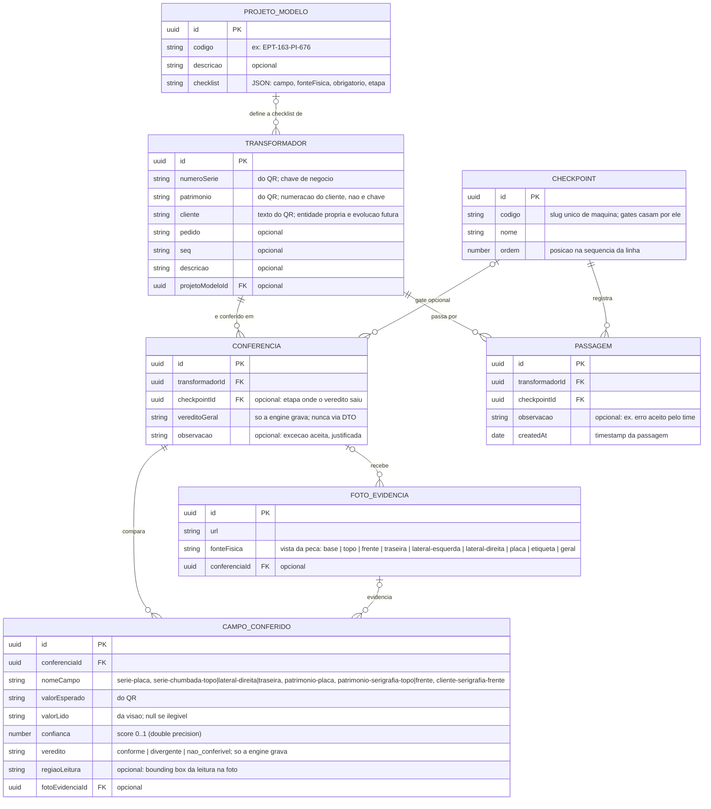
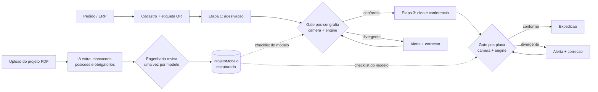

# SPEC.md

> Descreve o **sistema de conferência e rastreabilidade de transformadores
> TRAEL** — o que vamos construir no HackStars Batch #2. O que foi planejado
> mas não faz parte desta rodada vive na seção final "Planejado / rodadas
> futuras" — nada fora dela deve ser lido como escopo da primeira entrega.

## Problema

A TRAEL fabrica transformadores cuja identidade física existe em três lugares
da peça, gravados por processos diferentes: o número de patrimônio serigrafado
em tinta preta no tanque, a placa de identificação (placa preta rebitada, com
número de série, patrimônio e dados técnicos) e o número de série chumbado no
metal em 3 posições. A etiqueta adesiva com QR code é a fonte da verdade: traz
pedido, número de série, seq, patrimônio, cliente e descrição do produto.

Hoje a conferência entre essas fontes é visual e manual. Erros passam: uma peça
pode sair com série da placa divergente da série chumbada e da etiqueta (a
própria peça de demonstração do desafio carrega esse defeito: placa 847833,
etiqueta e chumbado 847233). Quando o erro chega à montagem final, laboratório
ou ao cliente, gera retrabalho, não conformidade, atraso de expedição e risco
de multa — as dores centrais do desafio TRAEL (doc "Rastreabilidade Inteligente
de Transformadores na Linha de Produção").

Este projeto automatiza a conferência: o operador lê o QR da etiqueta,
fotografa a peça com o celular, e o sistema extrai por visão computacional os
valores físicos, compara campo a campo com o QR e emite veredito com evidência
fotográfica. Sobre a mesma base, registra a passagem da peça por checkpoints da
linha, dando rastreabilidade de trânsito.

## Usuários

- **Operador de conferência** — lê o QR, fotografa a peça, recebe o veredito.
  Nesta rodada não há perfis nem permissões; qualquer pessoa com acesso ao app
  executa qualquer ação.
- **(Rodada futura) perfis por setor** — montagem final, laboratório,
  expedição, qualidade; marcados como futuros, não misturados ao atual.

## Entidades

- **Transformador** — identidade esperada da peça, criada a partir do payload
  do QR: número de série, patrimônio, pedido, seq, cliente, descrição, e
  vínculo opcional ao ProjetoModelo. `numeroSerie` é a chave de negócio (única
  do fabricante; por isso é chumbada 3× no metal): find-or-create usa ela.
  Patrimônio é numeração do cliente — único por cliente, não globalmente;
  nunca serve de chave.
- **ProjetoModelo** — o projeto de serigrafia de um modelo como dado: código
  (ex.: EPT-163-PI-676), descrição e checklist de campos a conferir. Cada item
  da checklist tem quatro chaves: `campo`, `fonteFisica`, `obrigatorio` e
  `etapa` (o `codigo` do Checkpoint em que a marcação passa a existir na peça —
  é o que permite a conferência parcial por gate; item sem `etapa` é conferido
  em qualquer etapa). É de onde a engine tira a lista de campos —
  nunca de constante no código. Seed do MVP: o modelo da peça de demo,
  transcrito manualmente do desenho; ingestão automática do PDF é evolução
  (Could).
- **Conferencia** — uma execução de verificação de uma peça: referência ao
  Transformador, conjunto de CampoConferido, veredito geral, timestamp,
  `observacao` opcional (exceção aceita pelo time é anotada aqui, na
  conferência divergente — auditável; com perfis, o aceite exigirá papel
  autorizado), e opcionalmente vinculada a um Checkpoint — quando presente, o
  vínculo registra em qual etapa da linha o erro foi acusado. Pode cobrir um
  subconjunto de campos: no fluxo real da TRAEL a conferência acontece em
  gates parciais (pós-serigrafia e pós-placa), não de uma vez só.
- **CampoConferido** — um campo comparado: nome (ex.: serie-placa,
  serie-chumbada-topo, serie-chumbada-lateral-direita, serie-chumbada-traseira,
  patrimonio-serigrafia-topo, patrimonio-serigrafia-frente, patrimonio-placa,
  cliente-serigrafia-frente), valor
  esperado (do QR), valor lido (da visão), score de confiança, veredito
  (`conforme` | `divergente` | `nao_conferivel`), referência à FotoEvidencia e
  `regiaoLeitura` opcional (bounding box de onde o valor foi lido na foto —
  matéria-prima da conferência posicional futura, custo zero com Textract).
  O nome do campo diz o que ele carrega (prefixo `serie-`/`patrimonio-`/
  `cliente-`, que é por onde o valor esperado do QR é achado), como a marcação
  foi gravada (`-chumbada-` em relevo, `-serigrafia-` em tinta) e em qual VISTA
  da peça ela está — nunca por número de posição.
- **FotoEvidencia** — foto enviada pelo operador, armazenada com URL, a
  `fonteFisica` que ela mostra e vínculo aos campos extraídos dela.
  `fonteFisica` é a **VISTA da peça**, não a marcação: `base`, `topo`,
  `frente`, `traseira`, `lateral-esquerda`, `lateral-direita` (as orientações
  do desenho técnico), mais `placa` e `etiqueta` — closes, porque zoom é um
  eixo separado de orientação: as duas ficam sobre uma face, mas o texto é
  pequeno demais para uma foto de vista inteira — e `geral` como escape. É o
  eixo que a câmera fixa enxerga em produção (uma câmera vê *a lateral
  direita*, não "o chumbado 2") e o que elimina a numeração arbitrária de
  posição. Consequência: uma vista pode conter mais de uma marcação (o topo
  tem série chumbada e patrimônio serigrafado), e a ambiguidade daí decorrente
  é resolvida como `nao_conferivel`, nunca por chute.
- **Checkpoint** — etapa ordenada da linha de produção, com posição na
  sequência e `codigo` estável de máquina (slug único, ex.: `serigrafia`):
  regras de gate casam por ele, nunca por nome exibido nem por ordem. Etapas
  reais informadas pelo time: adesivação/separação da etiqueta → serigrafia →
  enchimento de óleo e conferência → fixação da placa de identificação
  (última). Seed do MVP com essas etapas; nomes ajustáveis com a TRAEL.
- **Passagem** — registro peça × checkpoint × timestamp, criado por scan
  do QR no checkpoint, com `observacao` opcional (ex.: "parou por erro aceito
  pelo time — motivo"). A posição atual da peça na linha é derivada (última
  passagem), nunca coluna duplicada.

## Funcionalidades (MoSCoW)

### Must

**Conferência de conformidade**

- Ler o QR da etiqueta pelo navegador do celular e decodificar o payload nos
  campos esperados.
- Upload de fotos da peça por VISTA (topo, frente, traseira, laterais) mais os
  closes de placa e etiqueta — cada foto pode conter mais de uma marcação.
- Extração por visão computacional dos valores físicos, cada valor com score de
  confiança e vínculo à foto de origem.
- Comparação campo a campo na API entre valor esperado e valor lido, com
  veredito por campo em 3 estados: `conforme`, `divergente`, `nao_conferivel`.
  A comparação é textual exata; a única exceção, medida em 2026-07-26, é o
  campo de cliente, conferido por contenção de token inteiro — a serigrafia
  carrega a MARCA e o QR a razão social com código, e a igualdade exata acusava
  a peça correta.
- Checklist de campos a conferir carregada do ProjetoModelo da peça (o modelo
  da demo entra seedado); nenhuma lista de campos vive em código.
- Veredito geral da conferência: `divergente` se qualquer campo divergir; senão
  `nao_conferivel` se qualquer campo for ilegível; `conforme` somente com todos
  os campos conformes.
- Tela de veredito campo a campo com a foto-evidência de cada valor lido.
- Fluxo de conferência abre fixado em uma etapa via URL
  (`?etapa=<codigo do checkpoint>`): cada celular simula a câmera daquela
  etapa, e conferências/passagens criadas por ele herdam a etapa
  automaticamente — em produção, cada câmera fixa é provisionada amarrada ao
  mesmo `codigo`.

### Should

**Rastreabilidade de trânsito**

- Registrar passagem da peça por checkpoint via scan do QR.
- Tela de histórico da peça: passagens em ordem cronológica.

**Alerta de divergência**

- Alerta visível fora da tela de veredito quando uma conferência resulta
  `divergente` — no fluxo TRAEL, divergência para a produção até correção; no
  MVP o alerta sustenta essa parada humana (bloqueio automático de avanço é
  futuro).
- Scan em checkpoint de peça cuja última conferência foi `divergente` exibe o
  alerta no ato.

### Could

- Conferência de consistência por achados livres: o extrator já devolve TODO
  o texto de cada foto e hoje descarta o que não é alvo — custo AWS zero em
  reaproveitar. Cada achado é cruzado contra o conjunto TIPADO de valores do
  QR (série, patrimônio, cliente); achado que não bate com nenhum vira
  alarme de inconsistência (pega placa errada mesmo sem rótulo de fonte,
  peça trocada na esteira e etiqueta impressa divergente do próprio QR).
  Regra de ferro: achado livre só rebaixa ou alerta, NUNCA promove a
  `conforme` — consistência não enxerga ausência (peça com uma marcação só
  é trivialmente consistente), então o `conforme` continua nascendo
  exclusivamente da checklist. Cruzamento é contra o QR, nunca "tudo contra
  tudo": série e patrimônio são números diferentes por design.
- Dashboard de linha: peças × último checkpoint × status de conformidade.
- Indicadores de auditoria: contagem de divergências por etapa (checkpoint) e
  por campo, agregando os dados que o Must já persiste.
- Check qualitativo de layout via Bedrock: marcações da face presentes e na
  disposição esperada do projeto da demo. É o ÚNICO papel que sobrou para o
  Bedrock depois da medição de 2026-07-25 (reprovado para ler número —
  docs/visao-ocr.md), e sobrou porque aqui alucinação pesa menos e não há
  concorrente OCR: a pergunta é "as marcações estão presentes e dispostas como
  o projeto manda?", não "qual é o número?". Nunca rebaixa um `divergente`
  textual nem promove nada a `conforme`.
- Ingestão do projeto: upload do PDF, extração da checklist via Bedrock e
  tela de revisão/aprovação que cria o ProjetoModelo (Fase 6 do PLAN).

### Won't (nesta rodada)

- Integração com ERP e sistemas de projeto (fonte da verdade é só o QR).
- Câmeras fixas na linha (MVP usa fotos de celular; ver Planejado).
- Perfis de usuário, permissões e auth elaborada.

## Módulos

Uma API NestJS com módulos por domínio e um front Next.js que só exibe o que a
API decide. Detalhe das fronteiras no CLAUDE.md.

- **transformadores** — parser do payload do QR e cadastro da identidade
  esperada.
- **conformidade** — engine de comparação (lógica pura, sem I/O) e endpoints de
  conferência.
- **extracao** — porta `ExtractorPort` e adapters de visão AWS; único lugar que
  fala com serviço de visão.
- **evidencias** — upload e storage das fotos (S3).
- **transito** — checkpoints e passagens da peça pela linha.
- **frontend** — Next.js: leitura de QR, captura de fotos, veredito, histórico.

O que nunca atravessa fronteiras: comparação de campos fora de `conformidade`;
SDK AWS fora de `extracao`/`evidencias`; veredito calculado no `frontend`.

Funcionalidade futura (auditoria, ERP, câmeras fixas) entra como módulo novo
atrás dessas mesmas fronteiras; engine e portas não mudam.

## Stack

- **NestJS** — API; base no boilerplate brocoders/nestjs-boilerplate
  (TypeORM + PostgreSQL, class-validator).
- **Next.js** — front web mobile-first (16, React 19, Tailwind 4); roda no
  navegador do celular do operador.
- **PostgreSQL** — banco relacional (default do boilerplate).
- **AWS** — S3 para fotos; **Textract** para extração, escolhido no spike com
  fotos reais (constraint 2) e mantido depois de medir a peça inteira. Bedrock
  ficou FORA da leitura numérica por medição, não por bloqueio: os modelos
  disponíveis na conta alucinaram número plausível onde o Textract admitiu não
  ter lido (docs/visao-ocr.md). USD 500 em créditos disponíveis.

## Constraints técnicas

1. **Prazo** — demo do hackathon em 2026-07-27 (2 dias). Corte de escopo segue
   a ordem MoSCoW invertida: Could cai primeiro, depois Should.
2. **Série chumbada de baixo contraste** — relevo da mesma cor do tanque; OCR
   clássico podia falhar. MEDIDO no spike T2.1 (docs/visao-ocr.md): o Textract
   lê o relevo com 99,9% de confiança de cima e 85,8% de lado — o risco não se
   confirmou NA FORMA PREVISTA (ilegibilidade). Ele voltou em forma pior na
   rodada dos recortes: **no relevo, a confiança do OCR mede enquadramento e
   não correção** — mesma foto e mesmo valor correto oscilaram de 37,3% a
   95,5% só mudando a margem, e leitura certa (84,3%) e errada (84,6%) convivem
   na mesma faixa. Nenhum limiar separa isso, então a mitigação deixou de ser
   só o limiar: leitura em relevo é RELIDA em recortes da própria região
   (consenso) e, sem corroboração, o campo nunca é acusado `divergente` — vira
   `nao_conferivel` com foto para conferência humana. `conforme` silencioso
   continua proibido em qualquer caminho.
3. **Fonte de imagem variável** — MVP usa fotos de celular; câmeras fixas vêm
   depois. A extração recebe imagens sem saber a origem (mesma porta para
   ambas).
4. **Créditos AWS limitados (USD 500)** — chamadas de visão só sob ação
   explícita do operador; sem reprocessamento automático em loop.
5. **Fonte da verdade única** — o valor esperado vem exclusivamente do payload
   do QR; sem ERP nesta rodada. Payload real DECODIFICADO em 2026-07-26 (ver
   decisões em aberto): o QR da PLACA traz um payload posicional de
   identificação (projeto, série, patrimônio, potência, classe e data — sem
   cliente/pedido/seq); o da ETIQUETA é só um código de lookup de 13 dígitos —
   e como o lookup exige ERP, a peça lida pela etiqueta depende da digitação
   manual (T3.1). A fonte da verdade do fluxo continua sendo a **etiqueta**: o
   QR da placa é auto-referente (vive no artefato que `serie-placa` e
   `patrimonio-placa` conferem), então placa trocada se confirma sozinha e a
   acusação sai nas chumbadas — a peça é barrada, mas a mensagem aponta o lado
   errado.

## Critérios de aceitação

1. Lido o QR da etiqueta e enviadas as fotos da peça de demo, a tela de
   conferência exibe comparação campo a campo cobrindo: série chumbada nas 3
   vistas em que ela está gravada (topo, lateral direita, traseira), série da
   placa, patrimônio da placa, patrimônio serigrafado nas 2 vistas do desenho
   (topo e frente) e cliente — cada valor lido com link para sua
   foto-evidência.
2. Com as fotos da peça de demo (placa 847833; etiqueta e chumbado 847233), o
   veredito geral é `divergente` e o único campo apontado como divergente é a
   série da placa.
3. Com um conjunto de fotos conforme, todos os campos resultam `conforme` e o
   veredito geral é `conforme`.
4. Campo com leitura ilegível ou confiança abaixo do limiar resulta
   `nao_conferivel`, e o veredito geral nunca é `conforme` enquanto existir
   campo OBRIGATÓRIO não conferível (campo opcional ilegível não bloqueia o
   conforme — decisão da rodada nucleo, PLAN T1.2).
5. Scan do QR em um checkpoint cria Passagem com timestamp, e a tela da
   peça lista as passagens em ordem cronológica.
6. Conferência com veredito `divergente` gera alerta visível fora da tela de
   veredito, e o scan dessa peça em um checkpoint exibe o alerta no ato.

## Planejado / rodadas futuras

> O que está abaixo é **planejado** e não faz parte da primeira entrega. A
> arquitetura já acomoda: a porta de extração aceita qualquer fonte de imagem,
> e o valor esperado é injetado na engine — trocar QR por ERP não toca a
> comparação.

### Câmeras fixas na linha

Captura automática em pontos estratégicos substituindo a foto manual. O fluxo
alvo desenhado pela equipe tem dois gates de conferência, cada um bloqueando o
avanço até corrigir: a etiqueta (QR) é aplicada logo após a pintura; o gate 1,
pós-serigrafia, compara a serigrafia com o sistema e devolve a peça para
correção se divergir; o gate 2, pós-aplicação da placa (última etapa), faz o
mesmo para a placa antes da finalização. Herda a constraint do desafio: peças
passam em dupla e nem todas as vistas ficam visíveis — exigirá escolha de
pontos de captura ou adaptação do fluxo.
Aceitação futura: peça passando no ponto instrumentado gera conferência
parcial daquele gate sem ação do operador, com as mesmas garantias dos
critérios 1–4, e divergência impede o registro de avanço para a etapa
seguinte.

**Requisito de hardware que saiu de medição, não de opinião: iluminação
rasante de direção fixa sobre a região da série chumbada** — idealmente duas
direções alternadas a 90°, para cobrir traço de qualquer orientação. O spike
de realce de imagem (2026-07-26, docs/visao-ocr.md) mediu que **~60 pontos de
confiança separam a melhor da pior direção de luz na MESMA foto**, e que a
direção ótima muda de foto para foto — porque cada uma foi tirada com a luz
ambiente incidindo num ângulo diferente. O relevo é definido por gradiente de
sombra: o que decide a legibilidade é o ângulo entre a luz e o traço, e esse
ângulo é a variável não controlada da captura manual. Não há filtro que o
corrija depois (17 variantes testadas e reprovadas), mas o gate pode fixá-lo
antes. É o item de maior alavancagem para levar à TRAEL no projeto das
câmeras.

### Integração ERP / sistemas de projeto

O valor esperado passa a ser cruzado com o ERP além do QR; divergência
QR × ERP vira um novo tipo de alerta. Aceitação futura: conferência aponta
origem de cada valor esperado (QR ou ERP) e acusa divergência entre origens.

### Fluxo alvo ponta a ponta (menos pessoas no circuito)

Do upload do projeto até a expedição, com humano apenas em três pontos:
aprovar a extração do projeto (uma vez por modelo), corrigir a peça física
quando um gate acusa, e registrar exceção deliberada (observacao na
conferência divergente, que libera o avanço com o aceite gravado; com perfis,
exigirá papel autorizado). A identidade da etapa vem do dispositivo: cada
câmera é provisionada amarrada ao `codigo` de um Checkpoint E à fonte
física que o seu ponto de vista enxerga (câmera do topo → `topo`; o eixo de
`fonteFisica` é a VISTA justamente por isso) — o
rótulo que o operador dá por foto no MVP vira dado de provisionamento; a
identificação é a geometria da instalação, nunca análise em runtime. Modelo
com menos marcações passa no mesmo gate sem reconfigurar câmera: quadro cuja
fonte não tem campo na checklist do modelo é descartado sem custo (mesma
regra da foto `geral` hoje), e cada gate cobra a interseção "recorte da
etapa ∩ fontes cobertas pelas câmeras dele".

1. Engenharia sobe o PDF do projeto do modelo → IA (Bedrock) extrai marcações,
   posições e obrigatoriedade → engenharia revisa e aprova → vira
   ProjetoModelo estruturado (a checklist que a engine consome). Upload é
   único por modelo: todas as peças daquele modelo reutilizam o registro, e o
   PDF nunca é lido em runtime. O desenho real tem revisões (00/01/02…):
   quando a ingestão existir, ProjetoModelo ganha versionamento por revisão —
   conferências antigas continuam apontando para a revisão vigente à época.
2. Pedido entra (futuro: ERP) → transformador cadastrado, etiqueta QR impressa
   → adesivação na etapa 1 (o QR nasce com a peça, não é conferido — é a
   referência).
3. Em cada etapa instrumentada, câmera fixa captura ao detectar a peça →
   extração → engine compara contra QR + checklist do projeto → conforme:
   Passagem automática e a peça segue; divergente: alerta e bloqueio de
   avanço até correção.
4. Gate final (pós-placa): última conferência total → libera expedição.
5. Indicadores de auditoria alimentados automaticamente por etapa e campo.

O MVP dos 2 dias percorre este mesmo desenho com três substituições: celular
no lugar da câmera fixa, checklist fixa da demo no lugar do ProjetoModelo, e
operador disparando o que depois será automático. A arquitetura não muda —
troca-se quem chama as portas.

### Projeto de serigrafia por modelo/cliente

O layout e o conteúdo das marcações variam por cliente e por modelo: o desenho
EPT-163-PI-676 é o projeto do modelo da peça de demo; outro cliente (Energisa,
outras distribuidoras) tem outro projeto, com marcações obrigatórias e
opcionais próprias e posições definidas. A conferência futura valida contra o
projeto do modelo: exige exatamente os campos obrigatórios daquele projeto,
ignora os não aplicáveis, e evolui para checar posição/dimensão das marcações
conforme o desenho. A engine já nasce preparada: a lista de campos a conferir
é entrada, nunca constante (ver CLAUDE.md), e cada leitura persiste seu
bounding box (`regiaoLeitura`) desde o MVP.
A verificação posicional tem dois níveis de complexidade distintos: o check
qualitativo (presença e disposição relativa das marcações) funciona com foto
de celular e entra cedo (ver Could); o quantitativo (posições em mm do
desenho) exige projeto transcrito para dado estruturado e geometria de câmera
conhecida — em tanque cilíndrico com foto não calibrada é fotogrametria, não
OCR — e por isso pertence à rodada de câmeras fixas calibradas.
Aceitação futura: dado um modelo com projeto X, a conferência cobra os campos
obrigatórios de X e nenhum outro; campo obrigatório ilegível ou ausente nunca
resulta `conforme`; peça de outro projeto conferida contra X é acusada.

### Auditoria e indicadores avançados

Relatórios de desvios, retrabalho e gargalos por etapa, na linha do doc do
desafio (não conformidades, OTIF). O modelo de dados do Must já registra a
matéria-prima — Conferencia, CampoConferido e Passagem com timestamps e
evidências; esta evolução é leitura agregada, não mudança de escrita.
Aceitação futura: relatório de divergências por etapa e por campo em um
período escolhido, batendo com os registros brutos.

### Perfis e permissões

Perfis por setor (montagem final, laboratório, expedição, qualidade) com ações
restritas por papel. Aceitação futura: usuário sem papel de conferência não
consegue criar Conferencia.

## Decisões em aberto (a confirmar)

- [x] **Política para campo parcialmente legível** — resolvido: **rejeitar
      sempre**, com limiar de confiança 0.9. O número saiu de medição, não de
      arbítrio: com a peça real, as leituras corretas do Textract ficaram
      entre 98,4% e 99,9%, e o único erro de dígito (2 lido como 8 numa foto
      lateral do chumbado) veio a 84,6% — dentro do limiar antigo de 0.8, o
      que produzia um `divergente` falso. Similaridade aproximada fica fora
      por princípio: em número de série, "quase igual" é divergente. Leitura
      fraca vira `nao_conferivel` com a foto anexada (2026-07-25).
- [x] **Formato do payload do QR** — resolvido por MEDIÇÃO em 2026-07-26
      (zxing-cpp sobre as fotos de `fotos-demo/`), com uma surpresa: a peça
      tem DOIS QRs e eles são de naturezas diferentes.
      **Etiqueta adesiva** (ETIQUETA-1.jpg) → `1001020511056`, 13 dígitos, da
      mesma família dos EAN-13 impressos ao lado (1001020511049,
      1001020508827). É **código de lookup**, não payload: o QR que o fluxo do
      MVP manda ler não carrega campo nenhum. Consequência direta: o fallback
      de digitação manual da T3.1 vira **necessidade**, não plano B — sem ERP
      nesta rodada (Won't), não há em que fazer o lookup. O parser marca esse
      payload como `tipo: 'codigo'` e a API responde 422
      `payload-somente-codigo`, nunca uma identidade chutada.
      **Placa de identificação** (PLACA-4.jpg e
      DIAGONAL-TRASEIRA-DIREITA-2.jpg, mesmo conteúdo nas duas leituras) →
      **payload posicional de identificação** (projeto, série, patrimônio,
      potência, classe e data), sem rótulo, linhas separadas por CRLF:
      `91616 / 19930 / TPD-408136 / 01/06/2026 / 847233 / 1 / 10 / 15 /
      251328 / 226/13299`. Corroborado pela etiqueta impressa e pela placa da
      mesma peça: TPD-408136 é o **código de projeto**, 847233 o **número de
      série**, 251328 o **patrimônio**; 10 e 15 são potência (kVA) e classe
      (kV) — que continuam FORA de `ORIGENS_DO_ESPERADO`, porque a potência
      não é valor esperado nesta rodada. Detalhe que vale registrar: **o QR
      da placa carrega a série CORRETA (847233), enquanto o número IMPRESSO
      nela é 847833** — o defeito da peça de demo é de impressão, e não
      contamina o payload; o cenário-âncora segue de pé.
      O parser (T1.1) ganhou esse formato em 2026-07-26.
      **Não é payload "completo"**: ele NÃO traz cliente, pedido, seq nem
      descrição. Consequência medida, e correta: conferência disparada pelo QR
      da placa **nunca chega a `conforme`** com o seed atual — o obrigatório
      `cliente-serigrafia-frente` fica `nao_conferivel` com motivo
      `sem-valor-esperado`, porque não existe valor esperado de onde tirar.
      A régua não se rebaixa para acomodar o QR menor (inventar esperado é
      exatamente o falso OK proibido pela regra de ouro); quem lê a placa e
      quer veredito completo completa cliente/pedido/seq pela etiqueta —
      digitados, como manda a T3.1.
      **Limitação de AUTO-REFERÊNCIA**: esse payload vive NA PRÓPRIA PLACA —
      o artefato que `serie-placa` e `patrimonio-placa` conferem. Se a placa
      errada for rebitada na peça, a identidade esperada e a marcação conferida
      saem da MESMA fonte: os campos `*-placa` se confirmam sozinhos e a
      acusação recai sobre as séries chumbadas, que são as certas. A peça
      continua barrada (`divergente`/`nao_conferivel` — não é falso OK), mas a
      mensagem aponta o lado errado do defeito. Por isso a **fonte da verdade
      do fluxo de conferência continua sendo a ETIQUETA** (constraint 5), e o
      QR da placa fica registrado como (a) prova de que o vínculo de projeto
      (TPD) viaja com a peça e (b) entrada aceita pelo parser, com esta
      limitação documentada. Guardrail de rodada futura (não implementado):
      payload de origem posicional marcaria sua procedência, e aí `*-placa`
      não poderia sair `conforme` sem corroboração externa (etiqueta ou ERP).
      Segue ABERTO, porque a amostra é de UMA peça: o significado das linhas
      1/2/6/10 (91616, 19930, 1, 226/13299), se as posições são estáveis entre
      modelos e se a etiqueta de outros clientes também é só lookup —
      confirmar com a TRAEL. Por isso a detecção do formato é estreita e
      qualquer linha fora do esperado vira 422, nunca campo chutado.
- [ ] **Código do ProjetoModelo: TPD ou EPT?** — o desenho da TRAEL traz dois
      números (Projeto TPD-408136, Desenho EPT-163-PI-676) e a etiqueta
      imprime o TPD; o seed usa o EPT. Hoje a demo resolve pelo fallback
      "único projeto do banco" — funciona, mas cadastrar um SEGUNDO projeto
      quebraria a resolução (422 projeto-modelo-indeterminado). Confirmar com
      a TRAEL qual número identifica o projeto e alinhar seed + cascata.
      Afeta T2.1/T6.1 (achado da revisão R2, rodada revisao).
      **Evidência nova (2026-07-26)**: o TPD-408136 viaja DENTRO do QR da
      placa (medição acima) — ou seja, é o identificador de projeto que chega
      junto com a peça, sem ninguém digitar. Recomendação: o `codigo` do
      ProjetoModelo migrar para `TPD-408136`, e aí a cascata de resolução
      acerta o projeto pelo QR em vez de depender do fallback "único do
      banco".
      **Aviso operacional — não é troca de string**: o seed faz upsert POR
      `codigo`, então mudar o valor CRIA um segundo ProjetoModelo nos bancos
      já populados (local e RDS) e passa a devolver 422
      `projeto-modelo-indeterminado` justo no caminho da demo. A troca exige
      runbook: `UPDATE` do registro existente nos dois bancos + seed alinhado
      na mesma leva, pós-demo.
- [ ] **Em QUAIS vistas cada marcação está** — desde a troca de eixo de
      `fonteFisica` (2026-07-25), a checklist não diz mais "chumbado 1/2/3" e
      sim em qual VISTA cada marcação vive. O mapa do seed foi MEDIDO nas
      fotos reais (docs/visao-ocr.md: série chumbada em topo, lateral direita
      e traseira; patrimônio serigrafado em topo e frente), não lido do
      desenho — **confirmar face a face com a TRAEL**. Mitigação interina
      (decisão do time, 2026-07-26): `serie-chumbada-traseira` rebaixada a
      OPCIONAL no seed, porque a "traseira" foi medida numa foto DIAGONAL que
      enxerga duas faces — pode ser a marcação da lateral vista de ângulo; um
      obrigatório em posição inexistente tornaria o `conforme` inalcançável
      para peça correta. Quando legível, ela segue conferida e coerida com as
      irmãs; a obrigatoriedade das outras duas chumbadas segue cobrando a
      redundância física. Volta a obrigatória (ou muda de vista) com a
      resposta da TRAEL. Duas perguntas juntas:
      (a) o 3× do chumbado é padrão de fábrica (vira esqueleto fixo de
      checklist) ou varia por modelo (segue dado por modelo — a checklist
      suporta os dois)? (b) as vistas medidas são as do desenho ou coincidência
      de como a peça de demo foi posicionada? Nada em `base` hoje: a vista
      existe no vocabulário, mas sem foto dela um item obrigatório ali tornaria
      o critério 3 inalcançável. Consequência na T6.1: a ingestão do PDF só
      produz os itens de serigrafia; placa e chumbados entram pré-populados
      como esqueleto padrão na tela de revisão (T6.2). Evolução conexa: o
      Textract devolve um bounding box por ocorrência (`regiaoLeitura`, já
      persistido) — N caixas distintas no MESMO quadro provam N posições, o
      que habilita uma vista panorâmica satisfazer mais de uma posição.
- [ ] **As marcações técnicas da face lateral entram na conferência?** — o
      spike de 2026-07-26 leu na lateral esquerda `G-07/28`, `AL` e `V`
      (aparentemente lote/data, alumínio e óleo vegetal), marcações reais da
      peça que a checklist NÃO confere. O time definiu o foco desta rodada em
      identidade (serigrafia × etiqueta e séries irmãs entre si) e ADIOU estas:
      se o desenho as exige, hoje é não conformidade passando batido.
      Confirmar com a TRAEL quais são obrigatórias; incluir é acrescentar itens
      à checklist, não mexer em código.
- [ ] **Distinguir a ETIQUETA da serigrafia por contraste** — a discriminação
      de 2026-07-26 separa três classes (relevo, tinta sobre tanque, claro
      sobre escuro na placa), mas a etiqueta é texto escuro sobre papel claro e
      cai na MESMA classe da serigrafia. Consequência medida como risco
      residual: se a serigrafia estiver ausente ou ilegível e a etiqueta
      aparecer no quadro, o número dela pode virar a leitura do patrimônio
      serigrafado — e, sendo a etiqueta a fonte da verdade, o valor SEMPRE
      bate, produzindo `conforme` para marcação que não existe na peça. A regra
      de unicidade protege quando as duas aparecem (duas tintas → não resolve).
      Correção proposta: acrescentar a luminância ABSOLUTA do entorno como
      quarto sinal — papel é muito mais claro que chapa pintada, e a medida sai
      do mesmo recorte que já é feito.
- [ ] **Unicidade do patrimônio entre clientes** — padrão do setor: série do
      fabricante é única, patrimônio é numeração do cliente (único por
      cliente). Confirmar com a TRAEL. Consequência já adotada: find-or-create
      de Transformador usa `numeroSerie` como chave (T1.1/T1.3), nunca
      patrimônio.
- [x] **Modelagem do Projeto de serigrafia** — resolvido: entidade
      ProjetoModelo (codigo, descricao, checklist JSON) criada na fundação e
      seedada com o EPT-163-PI-676; a engine consome a checklist do banco, e a
      ingestão automática do PDF virou Fase 6 opcional (2026-07-25).
- [ ] **Promover cliente a entidade própria** — hoje é campo texto em
      Transformador (a comparação do MVP é textual, QR × leitura da placa);
      vira tabela quando entrar validação contra cadastro/ERP (rodada futura).
      Migration barata pelos generators quando decidir.
- [x] **Framework do front** — resolvido: Next.js 16; o time já tinha subido o
      scaffold e ele venceu o Angular combinado na entrevista (2026-07-25).
- [x] **Prioridade do alerta de divergência** — resolvido: promovido de Could
      para Should; divergência para a produção até correção, e o alerta é o
      que sustenta essa parada no MVP (2026-07-25).
- [x] **Eixo de `fonteFisica`: marcação ou vista?** — resolvido: **VISTA da
      peça** (`base`, `topo`, `frente`, `traseira`, `lateral-esquerda`,
      `lateral-direita`, mais os closes `placa` e `etiqueta` e o escape
      `geral`). É o que a câmera fixa enxerga em produção e como o desenho
      técnico se organiza, e elimina a numeração arbitrária `chumbado-1/2/3`,
      que o operador tinha de decidir sem gabarito. `serigrafia` e `chumbado-N`
      saíram do vocabulário — são processos de marcação, não vistas; seguem no
      NOME do campo. Efeito assumido: vista com duas marcações torna a
      ambiguidade explícita (`nao_conferivel`) em vez de escondê-la num falso
      match (2026-07-25).
